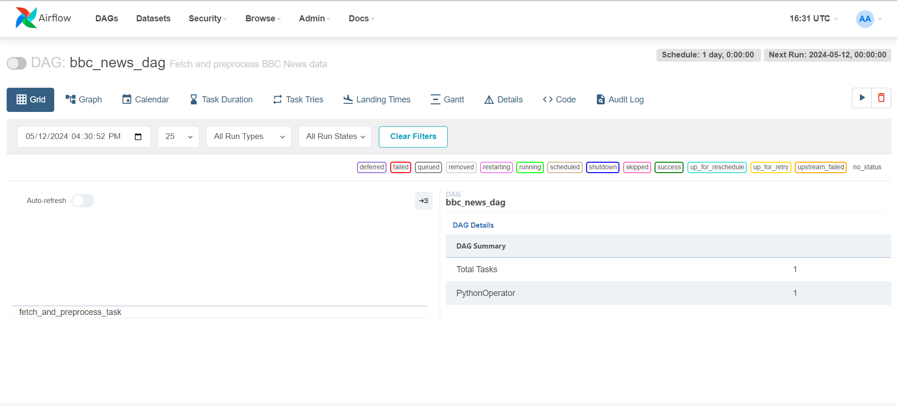

# MLOPS_Assignment02

# Data Preprocessing Workflow

This repository contains a Python script and an Apache Airflow DAG for automating the extraction and preprocessing of data from the BBC News website. Below is an overview of the workflow and the challenges encountered during implementation.

## Workflow Overview

1. **Data Extraction**: The script utilizes BeautifulSoup and requests libraries to scrape headlines and descriptions from the BBC News homepage.

2. **Text Preprocessing**: Text preprocessing is performed using a `preprocess_text` function, which cleans and formats the extracted text data.

3. **Data Storage and Version Control**: Preprocessed data is stored in a CSV file, and Data Version Control (DVC) is implemented to track versions and ensure reproducibility.

4. **Apache Airflow DAG Development**: An Airflow DAG named `bbc_news_dag` is created to automate the data extraction and preprocessing tasks on a daily schedule.

## Challenges Encountered

- **Apache Airflow Installation**: Difficulties were faced during Apache Airflow installation due to compatibility issues and system dependencies.

## Repository Maintenance

The GitHub repository is maintained with detailed descriptions of the assignment in this README file.

## Usage

To run the data preprocessing workflow, follow these steps:

1. Install the required libraries by running `pip install -r requirements.txt`.
2. Execute the Python script `fetch_and_preprocess_data.py`.
3. Optionally, set up Apache Airflow and import the `bbc_news_dag.py` file to automate the workflow.

## Conclusion

Despite encountering challenges during Apache Airflow installation, the implementation successfully automates the extraction and preprocessing of data from the BBC News website. The integration of DVC ensures version control and reproducibility of the data workflow.

---
*Note: Ensure proper environment setup and permissions before running the provided scripts and DAG.*
